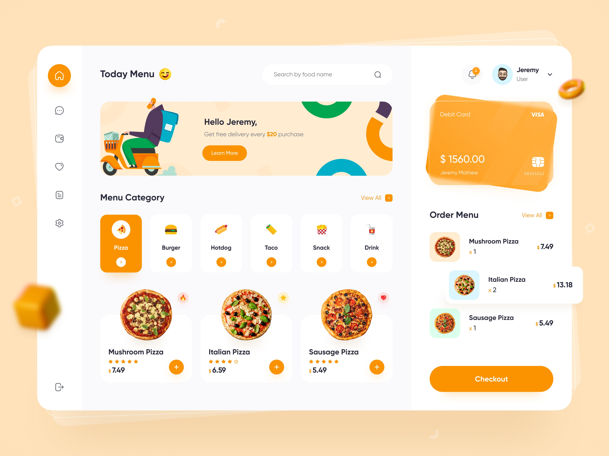

# Food Delivery App Design

A React App TypeScript

- Hosted at [Food Delivery App](https://prakharporwal.github.io/Food-Delivery-App/)

### Copying this Design At Dribbble

#### Features :

- [ ] Responsive for mobile screen
- [ ] Theming using CSS variables like Orange
- [ ] Functional With State Change
- [ ] Checkout Experience

### About package.json file

- How to set relative-path-in-index-html-after-build
- Why "homepage" set to "." ?
  See this link : https://github.com/facebook/create-react-app/issues/1487#issuecomment-277727669

### Setting up with ESLINT and Prettier to maintain code linting

- https://dev.to/knowankit/setup-eslint-and-prettier-in-react-app-357b
